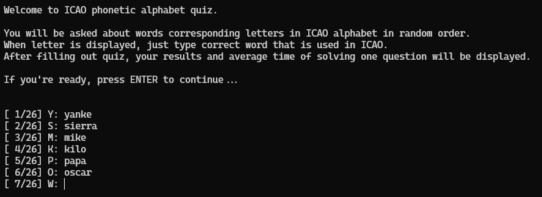
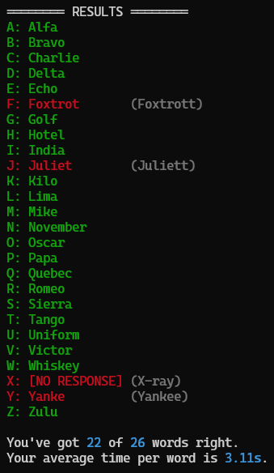

# ICAO alphabet quiz

Simple quiz program written in python, that tests your knowledge of ICAO phonetic alphabet (also known as NATO alphabet).

## Usage

To run quiz, you must first install requirements. You can archive this by running command:

```sh
pip install -r requirements.txt
```

Now you can start quiz by running

```sh
python icaoQuiz.py
```

## Screenshots



